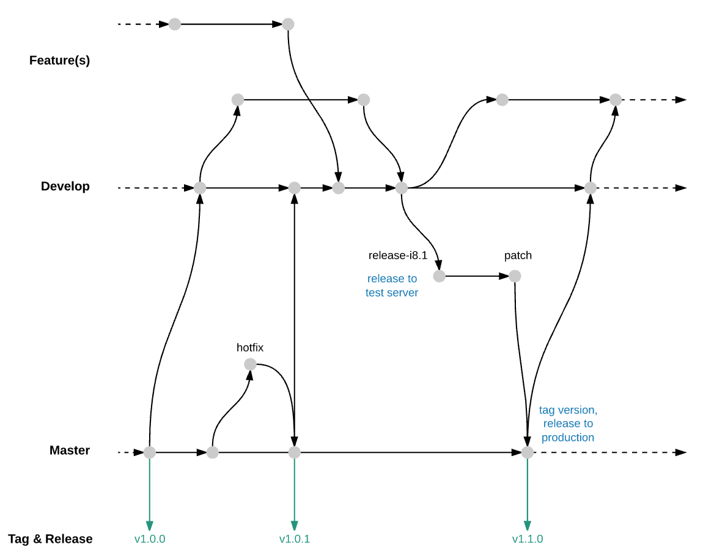

# Git Branching Model

Joinbox uses a more specific version of the git-flow branching model.




## General

- The master branch can be released at any time, it is always 100% stable.
- The release branch is published to a testing server for acceptance tests by the client. the client should receive the change log of the release branch.
- The develop branch contains only code that works, is stable and tested by the client.
- Features and bug fixes are developed in feature branches until they are stable. The branch, for basing feature branches on, is the release branch to which the task belongs to, or in the case of hot-fixes, the master branch.
- Feature branches may only be merged into the release branch if they are tested and work correctly.
- Feature branches will only be merged in to the according branch after at least one reviewer approved the pull request.
- For each iteration (release cycle, milestone) a new release branch is created from develop branch when the development starts.
- Fixes for the release branch are merged into the release branch.
- The release branch may be merged into develop or another release branch if it is required.
- Hot fixes are only created if they must be applied to the master branch for immediate release. they are based on the master branch.
- After a hot fix or release was released, the releaser merges the master branch into the develop as well as open release branches.
- Releases should planned in advance, there should not be more than one release branch at any time.
- After the release branch was merged into master and tagged with the correct version the release branch may be deleted.

## Naming
If a review on a pull request is requested, the corresponding branch must not be updated until changes were requested by the reviewer. If the developer wants to track the progress, a pull request without a reviewer assigned may be opened.

- A feature branch must be created for each issue based on the release branch. The name must follow the pattern `feature/<Identifier>-<Issue-Number>-<Short-Description-of-the-Issue>`. There may be multiple feature branches for one issue.
- A release branch must be created for each milestone based on the current develop branch. The name must follow the pattern `release/<Milestone-Name>`
A fix branch may be created for bugs or forgotten parts of a planned issue (inside a milestone) based on the release branch. The name must follow the pattern `fix/<Identifier>-<Issue-Number>-<Short-Description-of-the-Issue>`
- A hotfix branch may be created based on the current master branch, to fix a critical bug on the live system. Hofixes are not part of a planned release and will be released ASAP. The name must follow the pattern `hotfix/iss-<Issue-Number>-<Short-Description>`. Hotfixes may not be tested by the customer on the test system.


### Identifiers

Identifiers:
- Github Issue: iss
- JIRA: task, story, (epic)
- Generic: task, tsk


Examples:

Github
```
feature/iss-123-my-super-awesome-feature
fix/iss-123-fixes-my-nasty-bug
```

JIRA
```
feature/task-123-my-super-awesome-feature
fix/task-123-fixes-my-nasty-bug
```

Generic
```
feature/tsk-123-my-super-awesome-feature
fix/tsk-123-fixes-my-nasty-bug
```
